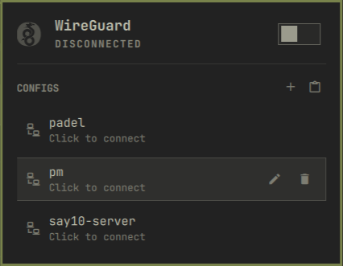

# Omawire — WireGuard tunnels in the Omarchy bar

Connect, switch, import, edit, rename and QR-export WireGuard tunnels from
the [Omarchy](https://github.com/basecamp/omarchy) bar — with live traffic, the
connection's own numbers, and a warning when a tunnel drops behind your back.

Omawire is an unofficial third-party widget. It is not affiliated with,
endorsed by, or connected to the WireGuard project.



Tunnels are NetworkManager connection profiles. The widget lists every
WireGuard profile NetworkManager knows about, and importing a `.conf` file
creates one. Switching is exclusive and transactional: the tunnel you pick
comes up and every other WireGuard tunnel goes down — but when interface
names allow it the new tunnel comes up *first*, and if anything fails the
previously active tunnels are restored, so a broken profile never leaves
you without the VPN you had. Non-WireGuard connections (wifi, ethernet,
tailscale) are never touched.

**No sudo, no root shell.** Everything goes through NetworkManager over
D-Bus, authorized by polkit — on a stock Omarchy desktop an active local
session controls networking without a password, so the widget needs no
sudoers rules and never prompts. Unlike `wg-quick`, NetworkManager does not
execute `PreUp`/`PostUp`/`PreDown`/`PostDown` shell hooks, so a config file
is data, not code: importing a malicious config cannot run commands. Configs
containing hook directives are rejected with a clear message.

## Requirements

- **NetworkManager** — running (Omarchy default).
- **`wireguard-tools`** — only `wg` is used, to validate keys before import.
- **`zenity`** — optional, for the file picker and the config editor.
  `kdialog` or `yad` also work for the file picker.
- **`wl-clipboard`** — optional, for importing a config from the clipboard
  and copying connection details.
- **`qrencode`** — optional, for showing a profile as a QR code.
- **`notify-send`** (libnotify) — optional, for the toast when a tunnel is
  deactivated externally.

No new privileges for any of it: everything still runs as your user.

## Install

```bash
omarchy plugin add https://github.com/glafeara/omarchy-wireguard.git
omarchy plugin enable glafeara.wireguard right
```

`plugin add` is interactive by default; add `--yes` to that command to skip
its prompt. The explicit plugin id and `right` placement make `plugin enable`
non-interactive. The plugin itself is five QML files and one shell script.

## Using it

**In the bar:** left click opens and closes the panel, right click
disconnects the active tunnel (or opens the panel when nothing is up),
middle click refreshes. The quick VPN toggle is the switch in the panel
header, the `t` key, or the IPC `toggle` command.

**In the panel:**

| Key | Action |
| --- | --- |
| `j` / `k`, arrows | move the cursor |
| `Enter`, `Space` | connect or disconnect the selected connection |
| `t` | toggle the last used tunnel |
| `i` | import a `.conf` file |
| `v` | import a config from the clipboard |
| `e` | edit the selected connection's config (closes the panel) |
| `n` | rename the selected connection (closes the panel) |
| `q` | show the selected connection as a QR code |
| `x` | delete the selected connection (asks first) |
| `r` | refresh |
| `d` | disconnect everything |
| `Esc` | close |

The row under the cursor shows three buttons: the pencil asks whether to
edit the config or the name, the QR square opens the code, the trash can
deletes. Either answer to the pencil closes the panel — the editor and the
rename prompt are windows of their own, and the panel would sit in front of
them.

**Connected tunnels sort to the top** of the list, name breaking ties, so
what is up is the first thing you see and the row the grid describes. The
cursor follows the profile it was on across that reorder, not the slot it
held — connecting a row moves it, and an Enter afterwards must not land on
whatever slid into its place. While a tunnel is up the header carries its
QR button next to the switch, so sharing the tunnel you are on does not
mean finding its row first.

**Connection details.** While a tunnel is up the panel shows what it is
doing, in the same grid the system network widget uses: ping and packet
loss, current rates, session totals, the tunnel address, the peer endpoint,
the routes it claims and the DNS it sets. Those last four copy on click, and
a value too long for its cell shows in full in the tooltip rather than
staying behind an ellipsis. Everything but the ping is read from
NetworkManager and `/sys`,
and the whole block is live only while the panel is open — a sampled figure
with nothing behind it yet, or nothing behind it any more, reads `--`
rather than `0 B/s`. The numbers are activity, not health: WireGuard has no
connection state, and an idle tunnel is not a broken one.

The endpoint and the routes belong to the profile's **first peer**. Most
tunnels have exactly one; a profile with several says so under the grid
(`first of 3 peers`), because one endpoint line cannot describe a
site-to-site setup and should not pretend to.

Nothing in this widget can bring up two tunnels at once — switching is
exclusive — but `nmcli`, another applet or a profile with autoconnect can.
Then the grid describes the first and says which one, since one endpoint
and one ping cannot stand for two; the tunnel it leaves out keeps a compact
traffic line of its own in the list below
(`↓ 3.0K/s ↑ 14.8K/s · ↓ 2.6M ↑ 1.1M`). The one in the grid does not — the
same four numbers twice on one screen is noise.

The **ping** is an ICMP probe bound to the tunnel device, so it measures the
path the tunnel actually routes rather than your physical link — it is the
one thing here that leaves your machine. It goes to `1.1.1.1` by default,
every three seconds while the panel is open, ten samples to a window; set
`pingHost` to something inside your tunnel, or to an empty string to switch
the probe off. A split tunnel that does not route the ping host shows `--`
rather than a scary 100%. Unprivileged: Omarchy leaves ping sockets open to
all users, so nothing here needs `CAP_NET_RAW`.

**Importing** asks for a name, because the interface is named after it and
the kernel only accepts up to 15 characters of `[A-Za-z0-9_=+.-]` — provider
files like `US-New York 03.conf` do not qualify. The name doubles as the
replace-or-not decision. Imported profiles never auto-connect; a tunnel
comes up only when you say so.

**Switching** is transactional. With distinct interface names the new
tunnel comes up before the old ones go down (the kernel is fine with
several wg interfaces at once); with a shared or unset interface name the
order has to be down-then-up, and a failed activation rolls back to what
was active before. The panel tells you which of the three outcomes you
got: switched, "the previous tunnels were restored", or — if the rollback
itself failed — a plain statement that the state is unknown. A successful
activation confirms NetworkManager's state, not the peer's reachability:
WireGuard has no connected/disconnected handshake state to report.

Replacing a profile during import is transactional too. If NetworkManager
refuses deletion of the old active profile and also refuses its rollback,
the operation reports that the state is unknown (backend exit `6`) instead
of implying that only the deletion failed. Both the old and fully built
replacement profiles are retained for manual recovery; the error names their
UUIDs rather than discarding the only new configuration. Exit `6` also marks
a failed cleanup of an incomplete replacement, so editor saves never retry
automatically on top of a profile that NetworkManager refused to remove.

**Renaming** changes the profile's display name (`connection.id`) only —
spaces are fine, duplicates are refused. The interface name never changes;
that one obeys kernel rules and belongs to import. The prompt opens in its
own window, centred on the screen like the QR code, and the panel closes
behind it; `Esc` or a click outside cancels.

**QR export** (`q`, the row's QR button, or the header's while a tunnel is
up) renders the profile as a QR code in
its own window, centred on the screen — the panel closes, so nothing sits
between the code and the phone's camera. `Esc`, `q` or a click outside
closes it. The PNG lives in `XDG_RUNTIME_DIR` (tmpfs, mode 0600) and is
deleted the moment the window closes. Mind what the code contains: **the
private key**. Scanning
it *moves* the profile, it does not add a device — a WireGuard server
tracks one endpoint per key, so two devices sharing a profile kick each
other offline on every handshake. File export exists too, IPC-only:
`exportConfig` below writes a 0600 `.conf` atomically.

**Notifications.** When a tunnel is deactivated by something other than
this widget — `nmcli` in a terminal, a NetworkManager restart, a dying
network — the bar icon turns urgent and one toast says
"Profile X was deactivated". Disconnects you asked for stay silent, and
several widget instances (one per monitor) coordinate through a lock so
you get one toast, not one per screen.

**Editing** closes the panel and shows the connection as wg-quick-style text
in zenity's text view — reconstructed from NetworkManager, secrets
included. Saving unchanged
text does nothing; saving over a running tunnel rebuilds the profile and
brings the tunnel back up on it. Text rejected by validation is handed back
to the editor rather than thrown away.

**Validation.** Every incoming config — file, clipboard or edit — is parsed
key by key. Keys must pass `wg pubkey`, which catches the truncated base64
copy-paste produces. Supported: `Address`, `DNS`, `ListenPort`, `MTU`,
`FwMark`, `Table`, and per peer `PublicKey`, `PresharedKey`, `AllowedIPs`,
`Endpoint`, `PersistentKeepalive`. Hook directives and unknown keys are
rejected outright — with this backend they would never run, and silently
dropping them would lie about what the tunnel does. A rejected import
changes nothing: the profile you had and the tunnel you were on stay as
they were.

## Settings

| Key | Default | Range |
| --- | --- | --- |
| `refreshIntervalSec` | `10` | 2–3600 |
| `pingHost` | `1.1.1.1` | any host, or empty to disable the probe |

```bash
omarchy bar set glafeara.wireguard refreshIntervalSec 30
omarchy bar set glafeara.wireguard pingHost ""     # no latency probe
```

## IPC

```bash
omarchy-shell glafeara.wireguard status                  # "VPN: kz" / "VPN disconnected"
omarchy-shell glafeara.wireguard details                 # the panel's grid on one line
omarchy-shell glafeara.wireguard toggle                  # connect/disconnect the last used tunnel
omarchy-shell glafeara.wireguard down                    # disconnect everything
omarchy-shell glafeara.wireguard refresh
omarchy-shell glafeara.wireguard open                    # also: close, show, hide
omarchy-shell glafeara.wireguard importConfig /path/to/tunnel.conf
omarchy-shell glafeara.wireguard edit kz
omarchy-shell glafeara.wireguard importPick              # opens the file picker
omarchy-shell glafeara.wireguard importPaste             # imports from the clipboard
omarchy-shell glafeara.wireguard rename kz kz-home       # display name only
omarchy-shell glafeara.wireguard exportConfig kz ~/kz.conf   # 0600, private key inside
omarchy-shell glafeara.wireguard qr kz                   # QR window, centred on screen
```

Commands that start an asynchronous action return `ok` only when it has
actually been accepted. Control actions reject another running control action;
picker, clipboard import, QR and export reject only their own already-running
worker, while an editor may open during a control action and queues its save.
An editor rejects a second editor or a queued editor save. `rename` to the
current name is an idempotent `ok`. Name-based commands refuse an ambiguous name and list the matching UUIDs
instead — pass a UUID to disambiguate. `details` answers with the addresses
whether or not the panel is open, and with `--` for everything sampled —
rates, totals and ping — because sampling stops with the panel. A figure
older than ten seconds reads `--` too: a stale total is a wrong total, not
an old one.

## What it touches

- **NetworkManager connection profiles** of type `wireguard` — lists them,
  activates and deactivates them, creates one per import, deletes only what
  you explicitly delete. Secrets live in NetworkManager's own root-owned
  storage under `/etc/NetworkManager/system-connections/`.
- `~/.local/state/omarchy/wireguard-last` — the UUID of the last tunnel you
  connected, so the bar's quick toggle reconnects what you actually used.
- `$XDG_RUNTIME_DIR/omarchy-wireguard.<uid>.{lock,intent,notified}` —
  the cross-instance lock, the short-lived "this deactivation was ours"
  markers behind the notifications, and the toast cooldown stamp. The
  backend requires a private, current-user runtime directory (or its safe
  `/run/user/<uid>` fallback) and refuses to use `/tmp`. These files are
  private and gone at reboot.
- `$XDG_RUNTIME_DIR/wg-qr.<shell-pid>.*.png` — the QR image while its window
  is open; deleted on close. On the next shell startup, images whose owner
  PID is dead are safely reaped without touching another live monitor's QR.
- `$XDG_RUNTIME_DIR/wg-edit.<shell-pid>.*` — private editor buffers and
  result files while zenity is open; deleted on every editor exit and reaped
  on the next shell startup after a crash.
- `/sys/class/net/<iface>/statistics/{rx,tx}_bytes` — read-only, for the
  traffic line, plus the interface's address and MTU for the detail grid.
- **One ICMP echo to `pingHost` every three seconds while the panel is
  open**, bound to the tunnel device — the only traffic the widget
  originates, and the only part of it you can switch off in the settings.

Everything runs as your user; authorization is NetworkManager's stock
polkit policy. Private keys are passed to `nmcli` on stdin, never as
command-line arguments — and the detail query runs `nmcli` without `-s`, so
it never reads a secret in the first place. No install or uninstall
scripts, no services, no telemetry.

## Tests

`tests/` holds backend suites that run against fake `nmcli`, `wg`, and
`qrencode` commands on
`PATH` — the only way to exercise the switch rollback paths, since a dead
endpoint does not make `nmcli connection up` fail — plus a manual
checklist (`tests/checklist.md`) for what needs real tunnels:

```bash
bash tests/run.sh
```

## Uninstall

```bash
omarchy plugin remove glafeara.wireguard
```

That disables the widget and deletes the plugin directory. Your tunnels stay
in NetworkManager — remove them with `nmcli connection delete <name>` if you
want them gone, and:

```bash
rm -f ~/.local/state/omarchy/wireguard-last
```

## License

MIT — see [LICENSE](LICENSE).

## Trademarks

"WireGuard" and the "WireGuard" logo are registered trademarks of
Jason A. Donenfeld. See [wireguard.com](https://www.wireguard.com/). Omawire
is an independent third-party widget: it uses the name only to describe
which tunnels it manages, carries none of the project's branding, and is
neither affiliated with nor endorsed by the WireGuard project. The MIT
licence above covers this widget's own code and grants no rights in anyone
else's trademarks.
